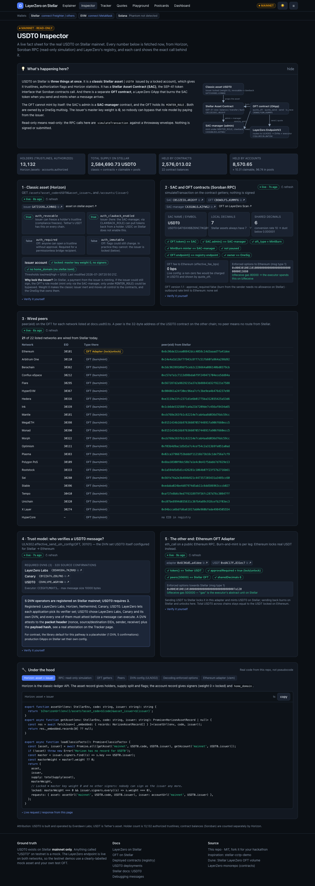

# LayerZero on Stellar: OFT & USDT0 demos

Eight small, heavily explained demos that teach how **LayerZero V2** works on **Stellar**, using **USDT0** (Tether's USDT delivered over LayerZero's OFT standard, live on Stellar mainnet since 2 September 2026) as the real-world example. Built for developers meeting cross-chain on Stellar for the first time and for hackathon teams who want something to fork.

Every page has the same shape: a **"What's happening here?"** explainer with a diagram, the **live demo**, and an **"Under the hood"** panel showing the exact code the page just ran (extracted from this repo's source at build time, not pseudocode).



## Ground truth: mainnet vs testnet

> **USDT0 does not exist on Stellar testnet.** It is mainnet-only. Any asset called "USDT0" on testnet is someone's mock.
> The **LayerZero endpoint is live on testnet** (EID 40600), so cross-chain messaging and custom test OFTs work there.

The site therefore splits into two modes, shown by a persistent badge on every page:

| Mode | Pages | What happens |
|---|---|---|
| **MAINNET · READ-ONLY** | Inspector, Tracker, Quotes, Dashboard | Reads the real USDT0 and real bridge messages via Horizon, Soroban RPC (`simulateTransaction`), the LayerZero registry and the LayerZero Scan API. Never writes, never asks you to sign. |
| **TESTNET** | Playground, Postcards, TestCoin | A clearly-labelled **mock** `tUSDT0` and a test OFT + postcard OApp wired through the live testnet endpoint to Sepolia. Freighter and MetaMask sign real testnet transactions. |

## The demos

| # | Page | Teaches |
|---|---|---|
| 1 | **What is an OFT?** | Burn-and-mint vs lock-and-mint (Stellar is `MintBurn`, Ethereum is an adapter), shared decimals and dust (interactive 7 → 6 decimal calculator), the endpoint / ULN / DVN / executor message path (animated), the three-contract shape of USDT0 on Stellar, and a quiz. |
| 2 | **USDT0 Inspector** | Horizon asset + issuer facts (flags, locked master key, no `home_domain`), SAC and OFT config via read-only simulation, wired peers for every USDT0 network, the ULN DVN set that actually protects the pathway, and the Ethereum adapter on the other end. |
| 3 | **Bridge Message Tracker** | The LayerZero message lifecycle from the Scan API: source tx → per-DVN attestations → commit → execution, with decoded packet header and OFT payload, status glossary, live polling. Reused by every other page. |
| 4 | **Fee & Quote Explorer** | `quote_oft` and `quote_send` on-chain (no API key), the two fees and their units, a five-chain comparison chart, and the Transfer API as a bring-your-own-key panel. |
| 5 | **Testnet OFT Playground** | Fund with Friendbot, trustline + faucet mint of the mock **tUSDT0** (a testnet copy of USDT0's setup: locked issuer, SAC-manager admin, `MintBurn` OFT), the wiring (`set_peer`, enforced options, `set_config` DVN override), then send it Stellar → Sepolia (Freighter) and back (MetaMask), tracking each message to delivery, with every XDR/calldata logged. |
| 6 | **Cross-Chain Postcards** | Raw LayerZero messaging with no tokens: a 140-byte postcard from Stellar lands in a Sepolia contract (and back), rendered on a wall with pixel-art stamps from the message GUID. |
| 8 | **TestCoin: born on Stellar** | Your own omnichain token: TESTCOIN is issued on Stellar and travels to Sepolia through a `LockUnlock` OFT (the one constructor argument that differs from tUSDT0). Live supply invariant: locked in the Stellar OFT == minted on Sepolia. Faucet, send out, send back. |
| 7 | **Omnichain Dashboard** | Live ticker of USDT0 messages in/out of Stellar, wired-peer graph, current supply and a derived 7-day trajectory, linking to the Dune dashboard for the long view. |

## Architecture

```mermaid
flowchart LR
  subgraph Browser["Static SPA (Vite + React + TS + Tailwind)"]
    UI[Pages] --> LIB[src/lib: stellar / evm / layerzero]
    LIB --> WAL[WalletProvider: Stellar Wallets Kit · MetaMask (EIP-6963/viem) · Phantom]
  end
  LIB -->|GET| REG[LayerZero registry\nmetadata.layerzero-api.com]
  LIB -->|GET| SCAN[LayerZero Scan API\nscan(-testnet).layerzero-api.com]
  LIB -->|GET| HZ[Horizon]
  LIB -->|simulateTransaction / sendTransaction| RPC[Soroban RPC\nmainnet: 3 public RPCs with failover · testnet]
  LIB -->|eth_call| EVMRPC[publicnode EVM RPCs]
  LIB -.->|optional, your key| TAPI[Transfer API]
  subgraph Scripts["scripts/ (Node, tsx)"]
    BW[build-wasm.sh] --> WASM[contracts/wasm/*.wasm]
    CE[compile-evm.ts] --> ART[contracts/evm/artifacts]
    DT[deploy-testnet.ts] --> DEP[src/config/testnet-deployment.json]
  end
  WASM --> DT
  ART --> DT
  DEP --> UI
```

No backend and no secrets in the bundle. All data sources are CORS-open (verified 2026-09-10). Every fetch degrades to a cached copy or a bundled snapshot with a visible "live data unavailable" notice instead of a white screen.

**The registry is the source of truth.** `src/lib/layerzero/chains.ts` fetches `metadata.layerzero-api.com/v1/metadata/deployments` at runtime (cached 15 min) and falls back to `src/config/registry.snapshot.json`, which `pnpm verify:registry` refreshes at build time and diffs against the documented addresses in `src/config/layerzero.fallback.ts`. The home page and the testnet pages show a "registry check" panel.

## Run locally

Prerequisites: Node 24, pnpm 11.

```bash
pnpm install
pnpm dev                 # http://localhost:5173
pnpm verify:registry     # refresh the registry snapshot and report address drift
pnpm test                # vitest: codecs against real on-chain byte vectors
pnpm typecheck && pnpm lint && pnpm build
pnpm smoke               # headless Chrome: every route, console errors, screenshots to docs/screenshots
```

The mainnet pages work immediately. The testnet pages read `src/config/testnet-deployment.json`; this repo ships with the Stellar half deployed (below).

## Deploy the testnet OFT

You need a wallet for each side: **Freighter** (or any Stellar Wallets Kit wallet) on Stellar **Test Net**, and **MetaMask** on **Sepolia**. The scripts need Stellar testnet keys (generated and Friendbot-funded automatically) and an EVM deployer key with about 0.02 Sepolia ETH.

```bash
cp .env.example .env               # keys are generated on first run if left empty
pnpm build:wasm                    # Rust 1.90.0 + wasm32v1-none: builds oft, sac_manager, postcard_oapp, faucet (artifacts are committed, so you can skip this)
pnpm compile:evm                   # solc-js: TestOFT.sol + PostcardOApp.sol (artifacts are committed too)
pnpm deploy:testnet --stellar      # asset → SAC → SAC-manager → set_admin → OFT(MintBurn) → Faucet → MINTER_ROLE → lock issuer → PostcardOApp
pnpm deploy:testnet --evm          # TestOFT + PostcardOApp on Sepolia, setPeer(40600), setEnforcedOptions; then wires Stellar → EVM:
                                   #   set_peer, set_enforced_options, endpoint.set_config (send + receive ULN naming the active DVN)
pnpm e2e:testnet                   # script-signed proof: faucet drip → tUSDT0 Stellar → Sepolia + a postcard, tracked to DELIVERED
pnpm e2e:testnet --reverse         # Sepolia → Stellar
pnpm deploy:testcoin               # TESTCOIN: LockUnlock OFT on Stellar + OFT on Sepolia, wired the same way
pnpm e2e:testnet --testcoin        # TESTCOIN Stellar → Sepolia
```

`deploy-testnet.ts` is idempotent (progress in `scripts/.state/`), pulls the endpoint, ULN and DVN from the registry, and refuses to run if the registry's Stellar testnet EID is not 40600. Commit the updated `src/config/testnet-deployment.json` so the site picks it up.

### Current deployment (Stellar testnet EID 40600 ↔ Sepolia EID 40161)

**tUSDT0** (mirrors USDT0: `MintBurn`)

| Piece | Address |
|---|---|
| Mock asset | `tUSDT0:GB3QCH2JLGYMYNCTVC45LSKGMCRQOEVF46IUQAEWW67JOMHW63ZMAFEJ` (issuer locked, flags revocable + clawback) |
| SAC | `CCM64LC7ZB426DRO7MNDDQYL3ATYPIISRJX6B7SUTTEJCCZF2BXN2XLT` |
| SAC-manager (SAC admin) | `CBDTSASNBUEAUBJVZL5TCSWNL7GMJ63MFFGJZNPVFAJMHHLELZ73BGM2` |
| OFT (`MintBurn`) | `CB4M3EC45CYVUYHRUY6T3UYBCM3E5JVA7SQF5OTIQY2IR3KHL3RT42GE` |
| Faucet (1,000 tUSDT0 per drip, ~1 h cooldown) | `CBFDW3L2CG7RUANKFSLGIOREVMXLW52EKLARBSIVGVP424LMNRNHLPUS` |
| PostcardOApp (Stellar) | `CA3ENHJE57OE4NIUWRMCGA3NJ355NV2YPX6CMIVIUQZG77KZBA7EIFPX` |
| TestOFT (Sepolia, 6 decimals) | `0x3ae0ed1dffacc319af52a8fe3fa93638d70e6e8e` |
| PostcardOApp (Sepolia) | `0xf06c1948d85e7539c6e4b424d620831581c908be` |

**TESTCOIN** (born on Stellar: `LockUnlock`)

| Piece | Address |
|---|---|
| Asset | `TESTCOIN:GC24D4L7YM3LVTRLKHT4NI7MKEA3CRNP65HZDGE4RWHUACMONHP6GSPN` (issuer locked) |
| SAC | `CA4KEI5HCEYHKIEI6SVQLLQOML4JXEWORP4QYWKARCDPCSGXSKGXGEKS` |
| SAC-manager | `CBTANY3JC6WLOW3GIPRKXUFFMVAOONYV3GZM5VVX6BFIBMY5H7HF4V4H` |
| OFT (`LockUnlock`) | `CBGMS5C3M6R3KSPMP4SXF4TP6IUSVQZ2A2TL4LQOQPAPSKLCT3RH2ZYI` |
| Faucet (500 TESTCOIN per drip) | `CBLA3GCWW2I7R67OAYCAMCXYSVCLG6XKFBAG4BZGP2WOMSTKAYXIDCUR` |
| TestCoin OFT (Sepolia) | `0x242ad7aaecf92d471703dcdc3669068597029b61` |

Shared: endpoint `CALTBA5S…`, ULN `CCMLPCAW…`, DVN `CB7EWGPR…` (LayerZero Labs); Sepolia endpoint `0x6EDCE654…`; both OApps carry per-OApp send and receive ULN configs naming the active DVN, enforced options of 200k gas towards Sepolia and 500k towards Stellar.

Both mocks mirror USDT0's admin model on purpose: issuer locked, SAC admin = SAC-manager, new supply only under `MINTER_ROLE` (the OFT needs it only in `MintBurn` mode; the Faucet always has it, so no key is ever needed in the browser).

## Known caveats

- **Testnet redeploy risk.** The Stellar testnet endpoint was redeployed in August 2026. Every testnet address in the original brief for this project was stale: endpoint `CBQOTWFU…` is now `CALTBA5S…`, ULN `CAWCTJDD…` is now `CCMLPCAW…`, executor `CD26IUC2…` is now `CCAVZ7ES…`, and so on (`BRIEF_STALE_TESTNET` in `src/config/layerzero.fallback.ts` keeps the old generation). At one point two contracts claimed EID 40600 and only one was in the registry. Always resolve addresses from the registry; the Playground's health check compares the deployed OFT's `endpoint()` with the registry before letting you send.
- **Single testnet DVN, and a stale default.** Testnet has one active DVN (LayerZero Labs). The ULN's *default* send/receive configs for the EVM testnets still name a **deprecated** DVN, so an out-of-the-box OApp `send` fails with `#1213 UnsupportedMessageLib` (after `quote` succeeds). The deploy script sets a per-OApp ULN config (`config_type` 2 and 3) requiring the active DVN.
- **Registry key quirk.** The `deployments` endpoint keys Stellar as `stellar-mainnet` / `stellar-testnet`; the `metadata` endpoint uses `stellar`. Inner `chainKey` values (what Scan uses) are `stellar` and `stellar-testnet`. `chains.ts` handles both.
- **Transfer API needs a key.** `POST /v1/quotes` returns 401 without an `x-api-key` (early access via LayerZero's form). Page 4 quotes on-chain instead and offers the API as bring-your-own-key. Its `/tokens?chainKey=` filter is ignored server-side, so we filter client-side.
- **DVN count.** The registry lists **five** active DVN operators on Stellar mainnet (LayerZero Labs, Horizen, Nethermind, Canary and USDT0's own DVN). USDT0's pathway config requires **three** (LayerZero Labs, Canary, USDT0) with 320 Stellar confirmations. The Inspector reads this live rather than hardcoding a number.
- **Burn/mint is per leg.** Stellar's OFT is `MintBurn`; Ethereum's is an OFT *Adapter* that locks canonical USDT (`approvalRequired = true`). Never promise burn-and-mint on both ends of a route.
- **Public RPC limits.** Public Soroban RPCs keep about 7 days of events and rate-limit bursts (some 429s carry no CORS headers, which browsers report as CORS errors). The app caps concurrency at 4 in-flight calls and fails over across three mainnet RPCs.
- **Scan API windows.** `/messages/latest` is newest-first and paginated with `nextToken`; the Dashboard's 7-day view walks a handful of pages.
- **Attribution.** USDT0 is built and operated by **Everdawn Labs**; USDT is Tether's asset.
- **Solana.** Phantom is supported in the wallet bar and for Tracker lookups only. No Solana Postcards leg: there is no verified Stellar-testnet ↔ Solana pathway, and a Solana OApp is an Anchor program (see CONTRIBUTING for the extension idea).
- **HyperCore** is listed by USDT0 but has no EID in the registry; it appears as "no EID" in the peers table.

## Project layout

```
src/
  config/        networks, USDT0 addresses, documented LayerZero fallbacks, registry snapshot, testnet deployment
  lib/layerzero/ registry client, Scan client, options type-3 / packet header / OFT payload codecs, tracker hook, Transfer API
  lib/stellar/   RPC failover, ScVal helpers, read-only simulation, signed tx path, Horizon, OFT / ULN / endpoint / SAC wrappers
  lib/evm/       viem clients, OFT + PostcardOApp ABIs
  lib/wallets/   WalletProvider (Stellar Wallets Kit, EIP-6963/MetaMask, Phantom)
  components/    shell, explainer, under-the-hood, lifecycle pipeline, charts, diagrams
  pages/         the seven demos
contracts/
  stellar/postcard-oapp, stellar/faucet   Rust (soroban-sdk 25.1.1)
  evm/src                                 Solidity (TestOFT, PostcardOApp)
  wasm/, evm/artifacts/                   committed build outputs + manifest
scripts/         build-wasm.sh, compile-evm.ts, deploy-testnet.ts, e2e-testnet-send.ts, verify-registry.ts, smoke.ts
tests/           vitest
```

## Links

- [LayerZero on Stellar](https://docs.layerzero.network/v2/developers/stellar/overview) · [OFT on Stellar](https://docs.layerzero.network/v2/developers/stellar/oft/overview) · [Deployed contracts](https://docs.layerzero.network/v2/deployments/deployed-contracts) · [Debugging messages](https://docs.layerzero.network/v2/concepts/troubleshooting/debugging-messages)
- [USDT0 deployments](https://docs.usdt0.to/technical-documentation/deployments) · [Stellar docs: USDT0](https://developers.stellar.org/docs/tokens/usdt0-layerzero)
- [LayerZero Scan](https://layerzeroscan.com) · [Scan API spec](https://scan.layerzero-api.com/v1/openapi) · [Registry](https://metadata.layerzero-api.com/v1/metadata/deployments)
- [Dune: Stellar LayerZero OFT volume](https://dune.com/stellar/stellar-layerzero-oft-volume)
- Inspiration: [ElliotFriend/stellar-cctp-demo](https://github.com/ElliotFriend/stellar-cctp-demo)

MIT licensed. Fork it.
